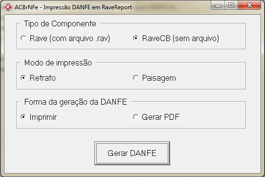
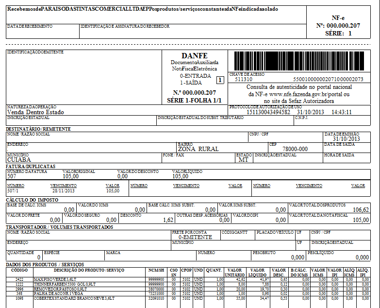

# ACBrNFe.DANFE.Rave

## Sobre 

  * Componente Delphi/Lazarus para impressão da DANFE em RaveReports no projeto ACBr (http://www.projetoacbr.com.br).
  * Compatibilidade com as Versões do RaveReport no Delphi7, D2005, D2006, D2007, D2009, D2010, XE, XE2.
  * Compatibilidade com o trunk2 do projeto ACBr.
  * Compatível com RaveReport em arquivo e Rave CodeBase.
  * Testes feitos com Delphi XE2.

## Instruções para compilar o ACBr com DANFE em Rave

  * Incluir no library path do Delphi o path: "..\ACBr\Fontes\ACBrDFe\ACBrNFe\DANFE\NFe\Rave"
  * Abrir um dos arquivos *.dpk (ACBr_NFeDanfeRV.dpk ou ACBr_NFeDanfeRVCodeBase.dpk) da pasta "..\ACBr\Pacotes\Delphi\ACBrDFe\ACBrNFe\DANFE\NFe\Rave".
  * Compilar e instalar.

## Utilização

  * Duas formas de utilização são possíveis com o componente:
  * ACBrNFeDANFERaveCB (Rave Code Base, sem o uso do arquivo de relatório .rav)
  * ACBrNFeDANFERave (com o uso do arquivo de relatório .rav). 

## Exemplo

Imprimir a DANFE:
```shell
ACBrNFe1.NotasFiscais.Clear;
ACBrNFe1.NotasFiscais.LoadFromFile("..\ArquivosXML\12345678901234567890123456789012345678901234-nfe.xml");
ACBrNFe1.NotasFiscais.Imprimir;
```

Gerar a DANFE em PDF:
```shell
ACBrNFe1.NotasFiscais.Clear;
ACBrNFe1.NotasFiscais.LoadFromFile("..\ArquivosXML\12345678901234567890123456789012345678901234-nfe.xml");
ACBrNFe1.NotasFiscais.ImprimirPDF;
```

## Screenshots




